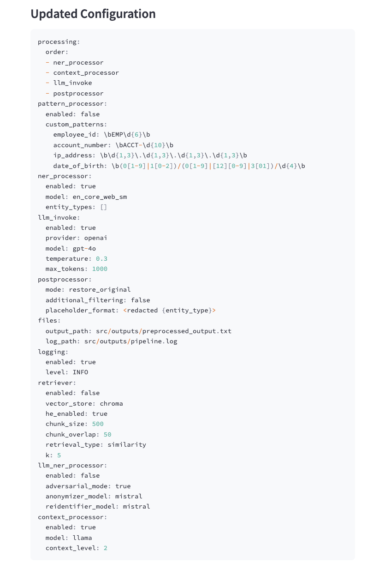

# LLM ANONYMIZATION FRAMEWORK


## Overview
This project provides a modular framework for anonymizing sensitive data before sending it to external large language models (LLMs) such as GPT, Claude, or Gemini. It supports customizable anonymization pipelines, retrieval-augmented generation (RAG) workflows, and evaluation tools for measuring masking quality and retrieval performance.

Organizations bound by data protection laws like GDPR and HIPAA often cannot use external LLMs directly due to data privacy concerns. This framework enables them to use powerful LLMs while maintaining compliance.

---

## Features
- **Interactive anonymization pipeline:** 
  - Pattern-based masking
  - Transformer-based NER (fine-tuned RoBERTa, DistilBERT)
  - LLM-based masking
  - Context-aware masking for culturally sensitive cases
- **RAG retrieval with ChromaDB:** 
  - Flexible configuration (chunk size, overlap, retriever model)
- **RAG retrieval with MongoDB Atlas:**
  - with Homomorphic encryption of embeddings before populating the database
- **Evaluation metrics:** 
  - Faithfulness, answer relevancy, context precision, context recall, answer correctness
- **Supports English and Ukrainian languages**
- **Open-source modular design:** 
  - Easy integration into external systems
  - Optional UI for building and testing pipelines
---


## Installation

We use UV package manager, optimized for fast installation. It automatically handles parralel downloads, creation and isolation of virtual environments, and ensures reproducable lockfile installs across systems.

To set the project:

```bash
git clone https://github.com/NaniiiGock/LLMAnonymizationThesis.git
cd LLMAnonymizationThesis

python -m venv .venv
source .venv/bin/activate

pip install uv

uv sync

```

## SpaCy Models installation:

```bash
uv run python -m spacy download en_core_web_sm
uv run python -m spacy download uk_core_news_sm
```

## Local LLMs setup:
Install [Ollama](https://ollama.com/download)
>>> ollama run llama3.2

>>> ollama run mistral

## MongoDB Atlas Setup:

- [Instruction on MongoDB Atlas Cluster Setup](https://www.mongodb.com/docs/atlas/getting-started/)

Put keys into .env:

- MONGO_DB_USERNAME
- MONGO_DB_PASSWORD
- MONGO_DB_HOST
- MONGO_DB_NAME
- MONGO_COLLECTION_NAME

---


## Framework Architecture 


## Directory Structure
```text
In scr/ :
database/      # DB managers for ChromaDB, MongoDB, Generic Manager
tests/         # Pipeline configurations and analysis
/models        # Training and testing NER models (Transformer-based and Adversarial Threat)
/processing    # Stores all processing modules
/providers     # LLM providers
/outputs       # Generated outputs and evaluation results
privacy_pipeline.py  - main PrivacyPipeline class

```


---

## Quickstart
1. **Prepare your input text or documents**

Document files, if not uploaded via UI, have to be locaded in ```.uploaded_files``` in the root of the project.

2. **Configure the pipeline** via a YAML or UI

The base configuration file can be used:
```.src/tests/test_configs/running_config_eng.yml```


Or created via UI. To run UI:

```bash
uv run streamlit run UI.py
```




3. **Set needed parameters in .env**

> LLM API (OPENAI_API_KEY)

> Mongo settings

> CONFIG_FILE (path to config.cfg)

4. **Run anonymization and retrieval**
5. **Integrate PrivacyPipeline into your application**

Example:

```python
user_input = "You are provided with a LLM Anonymization Thesis file"

task = "What are the key finding of the thesis?"

```

```python
config = {...}
privacy_pipeline = PrivacyPipeline(config)
result = await privacy_pipeline.process(user_input, task, RAG_files_folder)

print(result)
```

## And resulting response:

> The key findings of the LLM Anonymization Thesis are:

**Generalized Modular Framework**:

Unlike existing research that treats anonymization components separately, this thesis proposed a modular, configurable framework that integrates multiple anonymization techniques — including regex-based masking, transformer-based NER, LLM-based NER, context-aware masking, and homomorphic encryption — into a single unified system.

**Local LLMs for Secure Context-Aware Masking**:
Implemented local lightweight LLMs (LLaMA, Mistral) for context-aware re-identification, avoiding the use of closed APIs like GPT [11], and enabling anonymization workflows suitable for HIPAA- and GDPR-compliant environments.

**Addressing Cultural Bias**:
Introduced and evaluated context-aware masking approaches to reduce the Western cultural bias in LLM outputs. Experimental results showed that using CAM-2 significantly improves answer correctness (from ~40–50% up to ~98%) in culturally sensitive tasks.

**Performance Trade-Offs in Anonymization Methods**:

Direct usage of local LLMs (LLaMA, Mistral) without anonymization leads to poorer RAG performance, emphasizing the necessity for privacy-aware pipelines.

**Transformer-based NER** (SpaCy, fine-tuned RoBERTa) is more stable and accurate compared to LLM-based NER, confirming previous studies.

**LLM-based NER** offers flexibility for detecting non-standard entities but introduces risks of hallucination, requiring further validation (e.g., adversarial threat evaluation).

**Homomorphic Encryption for Secure Storage**:
Successfully integrated CKKS-based homomorphic encryption to secure text embeddings stored in cloud vector databases, maintaining compliance even with third-party storage providers.

**Interactive Interface for End-Users**:
Developed an interface to flexibly configure anonymization pipelines based on user choices for NER model, retrieval database, masking level, and LLM provider, allowing practical adoption in real-world production systems and internal APIs.

**Optimal Strategies for Different Scenarios**:

- SpaCy NER: Recommended for real-time, low-latency systems with general anonymization needs.

- RoBERTa NER: Recommended for high-accuracy anonymization in Ukrainian.

- CAM-1: Best for general-purpose tasks due to better latency-performance balance.

- CAM-2: Best for bias mitigation in culturally sensitive use cases.

---


## Limitations
- Domain-specific data is often needed for the best results
- LLM-based masking introduces slight latency
- LLM outputs can vary due to probabilistic generation
- Context-aware masking trades off information vs. privacy

---

## Future Work
- Add graph-based pipeline building (no config files)
- Modify LLM prompts from the UI
- Full automation without manual config
- Improve latency for large document processing
- Extend RAG with summarization techniques
- Support additional document formats (e.g., tables, spreadsheets)

---


## Links

- [Thesis Document](https://drive.google.com/file/d/1jLbC4d2mG49BCs7dEnnxqf0qsv5OM6VX/view?usp=sharing)
- [Fine-tuned DistilBert](nanigock/distil-bert-conll-2003)
- [Fine-Tuned SpaCy FinNER](nanigock/finer-ord-ner-spacy)
- [Fine-Tuned RoBERTa](nanigock/ukr-roberta-ner-finetuned)
